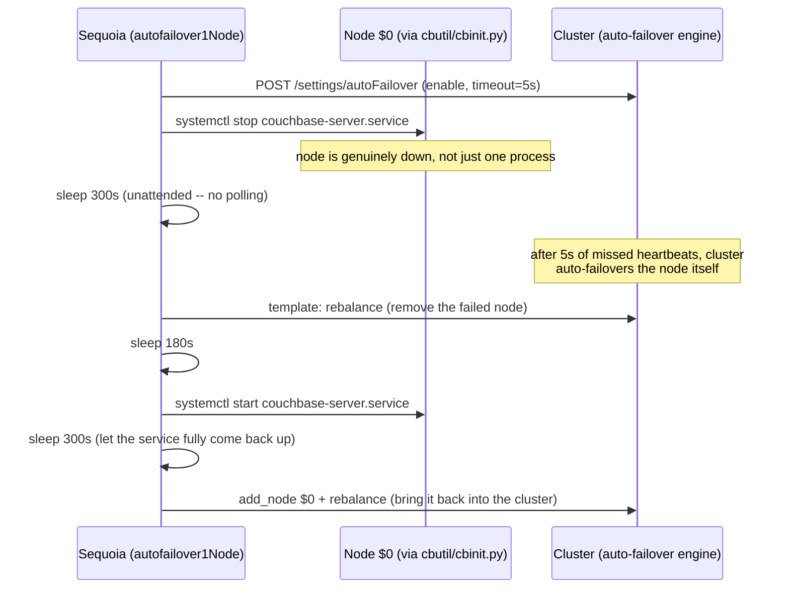

# How Sequoia stresses a cluster on purpose

Traced from `tests/2i/totoro/test_gsi_totoro.yml` (3,572 lines) and `tests/templates/multinode_failure.yml` — the two places this repo does chaos and pressure testing most seriously. Every command below is copied verbatim from those files, with real line numbers.

## 00 · Orientation

Two things run at once in every chaos test: **pressure** — sustained, concurrent read/write/index-churn load that keeps the cluster busy — and **chaos** — a deliberate fault injected while that load is running. Neither means much without the other: chaos against an idle cluster barely exercises anything; pressure without chaos is just a load test.

- **Pressure** — background load
- **Chaos** — fault injection
- **Verification** — did it survive

## 01 · The pressure layer

Totoro keeps three kinds of load running concurrently in the background — mutating scalar docs, mutating vector embeddings, and randomly creating/dropping indexes — all started without `wait: true`, which is what makes them background rather than blocking:

`tests/2i/totoro/test_gsi_totoro.yml:881-903`
```yaml
# mutate vector embeddings, continuously, for 3600s
- image: sequoiatools/siftloader
  command: "--connection_string {{.Orchestrator}} ... --mutate true --mutation_duration 3600"
  alias: vector_mutations_5a
# no `wait:` -> Async: true (ContainerTask.Async = !action.Wait) -> fire and continue

# mutate scalar fields, continuously, at a fixed rate
- image: sequoiatools/magmaloader
  command: "... --mutations_mode true --mutations_timeout 3600 --ops_rate 100"
  alias: vector_mutations_1b

# randomly create/drop vector + bhive indexes for 1200s
- image: sequoiatools/indexmanager
  command: "... -a random_index_lifecycle --create_bhive_indexes true --create_vector_indexes true --interval 1200 --timeout 1200"
  alias: lifecycle1

# the test just waits out the load window...
- image: sequoiatools/cmd
  entrypoint: sleep
  command: "1300"
  wait: true

# ...then explicitly tears the background container down
- client:
    op: rm
    container: lifecycle1
```

> **Why `alias:` matters here**
> An async action's container ID gets stored under its `alias` in `scope.Vars`. That's the only way to reach it again later — `client: op: rm, container: lifecycle1` looks it up by that alias to kill it once the load window is over. Without an alias, a fire-and-forget container just keeps running until Sequoia's own end-of-test cleanup.

## 02 · Three tiers of chaos

Every fault Sequoia injects lands at one of three levels, each with a different blast radius. Totoro uses tier 1 constantly; `multinode_failure.yml` is built entirely around tier 2.

**Tier 1 — Kill one process**
SSH in, `pgrep -f <name>`, `kill -SIGKILL`. The rest of `couchbase-server` keeps running; the killed daemon's own supervisor is expected to restart it. Smallest blast radius, used constantly in totoro against `indexer`, `projector`, `cbq-engine`.

**Tier 2 — Stop the whole service**
`systemctl stop couchbase-server.service` via `cbutil`/`cbinit.py` — the entire node goes dark, not one daemon. What `multinode_failure.yml`'s `autofailover*` templates use to make a node look genuinely down.

**Tier 3 — Rewrite cluster membership**
Failover (graceful/hard/forced), `rebalance_stop` mid-flight, swap rebalance. Doesn't touch a process at all — attacks the cluster's own understanding of who's in the cluster, while a real topology change is in progress.

> **What's *not* here**
> No network partitions, no disk-fill, no CPU/memory pressure tooling anywhere in `tests/templates/` — checked. Sequoia's chaos vocabulary is entirely process/service/membership level, not infrastructure level.

## 03 · The signature move: killing a process mid-rebalance

This is totoro's core technique, repeated a dozen times against different daemons: start a rebalance, let it run for a measured number of seconds, kill a process on the node that's actively receiving data, then verify nothing was lost once it finishes.

`tests/2i/totoro/test_gsi_totoro.yml:723-756`, verbatim
```yaml
# capture state BEFORE touching anything
- image: sequoiatools/indexmanager
  command: "... -a capture_index_names --snapshot_file /data/index_snapshot_rebalance_in_1.json"
  wait: true

- template: rebalance_in
  args: "{{.InActiveNode}}, index"
# no wait: -> fires the rebalance and returns immediately

- image: sequoiatools/cmd
  entrypoint: sleep
  command: "113"
  wait: true
# ^ blocks HERE, in Sequoia's own action queue, while the real
#   rebalance keeps running unattended on the cluster in parallel

- template: kill_process
  args: "{{.ActiveIndexNode 0}}, indexer"
# also fire-and-forget -- SIGKILL the indexer on the node the
# rebalance is actively streaming index data onto

- image: sequoiatools/cmd
  entrypoint: sleep
  command: "430"
  wait: true

- template: wait_for_rebalance
# the ONLY real synchronization point -- polls until status == "none"

- image: sequoiatools/indexmanager
  command: "... -a validate_index_names --snapshot_file /data/index_snapshot_rebalance_in_1.json"
  wait: true
```

**Timeline**

| t | Sequoia queue | Cluster (unattended) |
|---|---|---|
| 0s | `rebalance_in` fires (async) | rebalance starts, runs continuously |
| 0–113s | `sleep 113s` (blocking) | rebalance continues |
| 113s | `kill_process` fires (async) — SIGKILL indexer | kill lands inside the active data-transfer window |
| 113–543s | `sleep 430s` (blocking) | rebalance continues |
| 543s+ | `wait_for_rebalance` — blocks until status == `none` | rebalance finishes |
| after | `validate_index_names` | — |

> Both `rebalance_in` and `kill_process` omit `wait:`, so `ContainerTask.Async` is `true` for both (`lib/test.go`: `Async: !action.Wait`) — Sequoia's queue never blocks on either one finishing. The 113s figure isn't derived from a signal; it's a tuned estimate of how long index build/transfer takes for this data volume, aimed at landing the kill mid-transfer rather than before or after it.

This same shape repeats with different targets throughout totoro: `kill_process(<NthDataNode>, projector)` right after a rebalance starts (line 693), `kill_process(<n1ql node>, cbq-engine)` during sustained query load (line 703), `rebalance_stop` immediately after starting a rebalance-out (line 1152) to test recovery from an *abandoned* topology change rather than a completed one.

## 04 · Simulating a real outage: `multinode_failure.yml`

Tier 1 chaos (kill one process) assumes the rest of the node is fine. Tier 2 doesn't — it takes the whole `couchbase-server` service down via `cbutil`, which SSHes in and runs `systemctl stop couchbase-server.service` (`containers/cbutil/cbinit.py`), then lets Couchbase's own auto-failover feature — not Sequoia — decide when to react.



Note what Sequoia does *not* do here: no explicit failover call. Auto-failover is a real cluster feature being exercised on purpose — Sequoia just creates the conditions (short timeout, dead node, silence) and waits, then does normal recovery (rebalance the loss away, restart the service, add the node back). Compare this to `failover_node_forced` in tier 3, which calls failover directly instead of waiting for the cluster to notice on its own.

| Template | Shape |
|---|---|
| `autofailover1Node` | 1 node down, 1 replacement added back — `multinode_failure.yml:200` |
| `autofailover2Nodes` / `3Nodes` | Same shape, 2 or 3 nodes down simultaneously — lines 138, 66 |
| `multinodefailover` | 2 nodes down, explicit `wait_for_rebalance` instead of a blind sleep — line 4 |

## 05 · Proving nothing broke

Chaos without a check afterward is just noise. Totoro pairs almost every fault with a before/after invariant check, all run through `sequoiatools/indexmanager` — a purpose-built verification container, not a generic tool:

| Action | What it checks |
|---|---|
| `capture_index_names` | Snapshot every index definition to a file *before* the chaos window opens |
| `validate_index_names` | Diff live index definitions against that snapshot *after* — proves the killed-and-restarted daemon didn't silently drop an index |
| `wait_until_rebalance_cleanup_done` | Blocks until indexer-side post-rebalance cleanup genuinely finishes, not just until the REST status flips |
| `item_count_check` | Confirms document counts and index results agree after mutation/chaos, with a sampled dataset check |

> **The pattern, everywhere it appears**
> `capture_index_names` → chaos (kill / rebalance / failover) → `wait_for_rebalance` → `validate_index_names` → `wait_until_rebalance_cleanup_done`. Five steps, repeated with different chaos in the middle, roughly a dozen times across the file.

## 06 · Chaos template reference

Every chaos-capable template in the repo, with where it lives.

| Template | Tier | Location |
|---|---|---|
| `kill_process` | 1 | `tests/templates/rebalance.yml:395` |
| `memcached_kill` | 1 | `tests/templates/rebalance.yml:403` — SIGSTOP, not SIGKILL: pauses, doesn't crash |
| `start_memcached` | 1 | `tests/templates/rebalance.yml:412` — SIGCONT, resumes a paused memcached |
| `autofailover1Node` / `2Nodes` / `3Nodes` | 2 | `tests/templates/multinode_failure.yml:200` / `138` / `66` |
| `multinodefailover` | 2 | `tests/templates/multinode_failure.yml:4` |
| `enable_autofailover` / `disable_autofailover` | 2 | `tests/templates/rebalance.yml:360` / `383` |
| `failover_node` | 3 | `tests/templates/rebalance.yml:232` — graceful |
| `failover_node_forced` | 3 | `tests/templates/rebalance.yml:243` — `--force --hard` |
| `hard_failover_node` | 3 | `tests/templates/rebalance.yml:254` — `--hard`, no `--force` |
| `recover_node` | 3 | `tests/templates/rebalance.yml:267` — delta or full recovery |
| `rebalance_stop` | 3 | `tests/templates/rebalance.yml:331` — abandons a rebalance mid-flight |
| `rebalance_out_wo_wait` / `rebalance_in_wo_wait` | 3 | `tests/templates/rebalance.yml` — non-blocking variants, used to chain a kill onto an in-flight rebalance the same way totoro does |

---

*Everything on this page is quoted verbatim from `tests/2i/totoro/test_gsi_totoro.yml` and `tests/templates/{rebalance,multinode_failure}.yml`, with line numbers checked against the current files. The "nothing else exists" claim in §02 (no network/disk/CPU chaos) was a repo-wide grep, not an assumption.*
