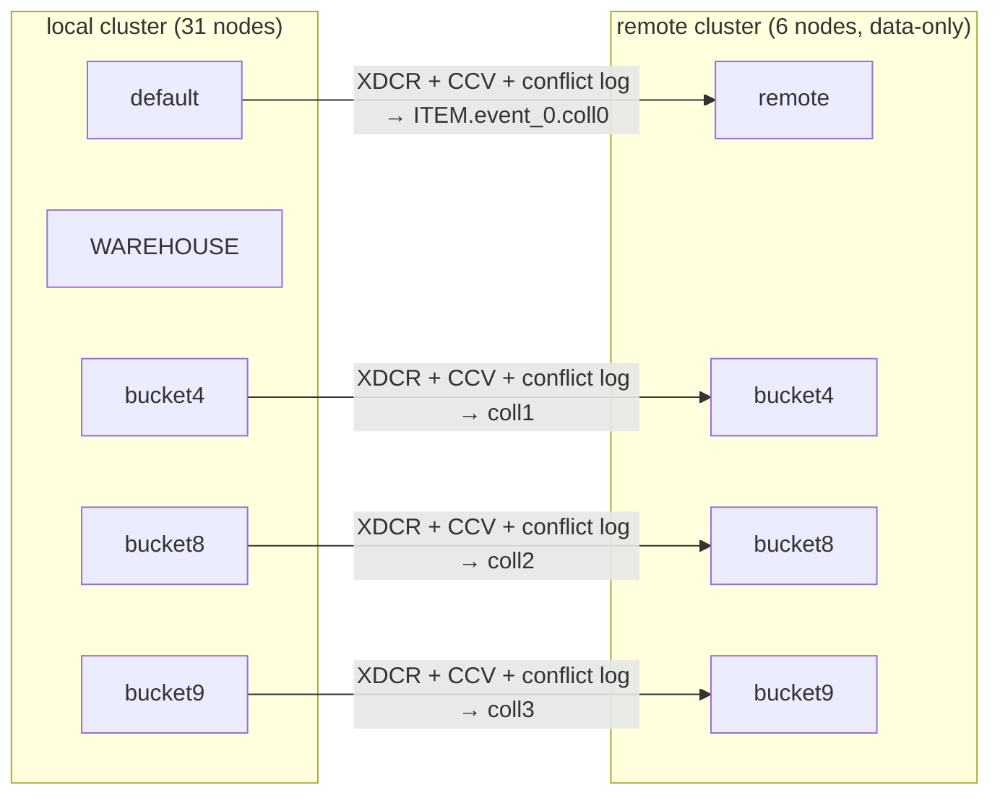
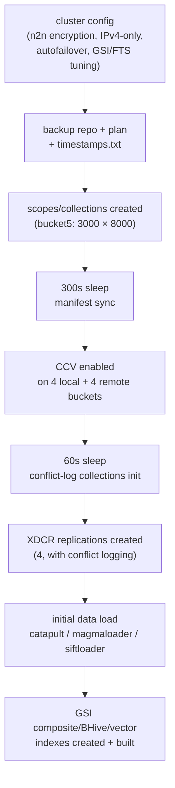
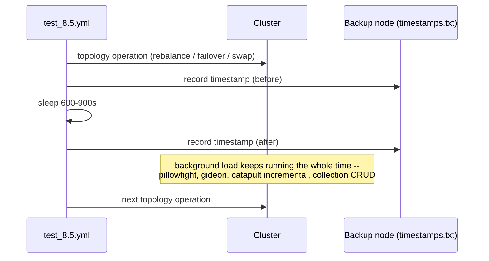

# How `test_8.5.yml` Actually Fits Together

A narrative companion to [AGENTS.md](AGENTS.md) in this directory. AGENTS.md is the reference — phase tables, exact scale factors, every command. This is the "why is it built this way" version: how the pieces depend on each other, what would break if you reordered them, and the one mechanism (`test:`/`section:`) that makes a 1,307-line test possible without reimplementing five other test suites inline.

## What kind of test this is

Compare it to `tests/2i/totoro/test_gsi_totoro.yml` (see [`tests/2i/totoro/CHAOS_AND_PRESSURE.md`](../../2i/totoro/CHAOS_AND_PRESSURE.md) if you haven't read that one) — totoro goes *deep* on one service family (GSI: vector indexes, replica rebalancing, indexer chaos) with everything else in the cluster mostly along for the ride. `test_8.5.yml` goes *wide*: KV, GSI, FTS, N1QL, Analytics, Eventing, XDCR, Views, Sync Gateway, and Backup, all running concurrently, all getting hit with topology changes, on the same 31-node cluster. It's not testing any one feature harder than a dedicated suite would — it's testing whether all of them survive happening *at the same time*, which is a different failure mode entirely (resource contention, RAM quota fights, one service's rebalance stepping on another's).

This is the shape a test takes once a feature has graduated from "does it work" (totoro, test_fusion_simple.yml) to "does it survive living next to everything else."

## The skeleton: two clusters, wired by XDCR



Everything else in the test — the topology chaos, the background load, the index churn — happens on the **local** side. XDCR replication to **remote** runs the entire time as a passive correctness signal: if any of the local-side chaos corrupts data or breaks replication, it shows up as an XDCR item-count mismatch at the very end (Phase 9). The remote cluster itself is never touched — no chaos, no topology changes — it's the control side of the experiment.

## Twelve buckets, each doing one job

AGENTS.md has the full RAM/storage/TTL table. What's worth understanding is that each bucket exists to isolate one concern, so a failure points at *what* broke instead of a tangle:

- **`default` / `WAREHOUSE` / `NEW_ORDER` / `ITEM`** — the baseline, TPC-C-shaped buckets. `WAREHOUSE` carries continuous backup (15 min interval); `ITEM` carries the `all_ids` view.
- **`bucket4`, `bucket8`, `bucket9`** — the XDCR trio, each also CCV-enabled, each mapped to its own remote bucket + conflict-log collection.
- **`bucket5`** — the collection-scale stress bucket, and the one thing that changed the most between 8.0 and 8.5: `scale × 3000` scopes, `scale × 8000` collections. Deliberately overloaded on manifest density, deliberately *light* on document count (`scale × 2`, down from `scale × 2000` in 8.0) — the point is stressing the collection manifest system, not data volume, so the doc load is dialed back to keep the two concerns separate.
- **`bucket6`, `bucket7`, `bucket8`, `bucket9`** — moderate scope/collection density (10-700 collections depending on bucket) plus GSI + FTS indexes; `bucket7` additionally feeds Sync Gateway; `bucket8`/`bucket9` also run continuous Collections CRUD in the background (create/drop scopes and collections while everything else is happening).
- **`bucket10`** — couchstore (the one non-magma bucket besides the ephemeral one), composite + vector (L2) GSI indexes over SIFT embeddings.
- **`bucket11`** — magma, BHive vector indexes instead of composite — a second, architecturally different vector-index path exercised in parallel with bucket10's.
- **`bucket12`** — ephemeral, no encryption, sparse vector embeddings via a dedicated `vectorloader` tool — the odd one out on purpose, to make sure the ephemeral + sparse-vector combination isn't silently broken by whatever the other 11 buckets are doing.

## Setup order is load-bearing — this is not an arbitrary sequence



A few of these steps would silently corrupt state if reordered, not just fail loudly:

- **Collections before XDCR.** XDCR replication needs matching collection manifests on both sides to route documents correctly — creating replications first would mean documents landing before their target collections exist.
- **CCV before XDCR.** Cross-cluster versioning changes how conflicts are resolved; it has to be set before there's any data in flight between the clusters, not toggled on after replication is already running.
- **Encryption/DEK settings before any data load.** Data written before encryption-at-rest is enabled doesn't retroactively get encrypted.
- **The two `sleep`s (300s after collections, 60s after CCV) aren't padding** — they're waiting on asynchronous convergence (manifest propagation, conflict-log collection creation) that has no REST endpoint to poll, so the test just waits out a known-safe margin instead. The same "sleep as synchronization" pattern shows up constantly in Phase 8 too.

## The trick that makes "comprehensive" maintainable: `test:` / `section:`

`test_8.5.yml` doesn't reimplement eventing deploy logic, analytics setup, or GSI topology-change chaos inline — it borrows named sections from the dedicated single-service test files that already have them:

```yaml
- test: tests/eventing/CC/test_eventing_rebalance_integration.yml
  section: create_and_deploy
```

This is a different mechanism from `template:` (which reuses a named snippet from a file loaded via `include:`). Traced in `lib/test.go:517`: `action.Test` triggers `ActionsFromFile(action.Test)` — reading the **entire other test file** — then filters it down to just the actions between the matching `section_start: create_and_deploy` / `section_end: create_and_deploy` markers in *that* file, discarding everything outside it. It then temporarily forces `SkipSetup`/`SkipTeardown`/`SkipCleanup` to true (the cluster's already built — don't redo that) and **recursively calls `t.Run(scope)`** on that filtered action list, before restoring the original flags and continuing.

Practically: eventing deploy/topology-change/pause/resume/undeploy, analytics setup/query/topology-change/teardown, and 2i's `change_indexer_topologies` chaos are all *quoted*, not copied, from `tests/eventing/CC/test_eventing_rebalance_integration.yml`, `tests/analytics/cheshirecat/test_analytics_integration_scale3.yml`, and `tests/2i/cheshirecat/test_idx_cc_integration.yml` respectively. If one of those source files' sections changes, `test_8.5.yml` picks up the change automatically, for better or worse — it's live composition, not a snapshot.

## The chaos wall (Phase 8), and the rhythm underneath it

Roughly 25 topology operations run back to back — rebalance out, swap rebalance, eventing topology change, analytics topology change, swap failover, swap *hard* failover, single-node autofailover, then a full FTS gauntlet (rebalance-in, hard-failover-and-addback, hard-failover-and-rebalance-out). AGENTS.md's Phase 8 table has the complete ordered list; the shape worth internalizing is the repeating unit:



**Nothing from Phase 7's background workloads ever gets paused for this.** Pillowfight (majority durability, all 10 buckets), gideon (TTL-based KV churn), incremental catapult (buckets 4-7, lazy-loaded every 300s), and the two Collections CRUD loops (bucket8/bucket9) all just keep running underneath the entire 25-operation sequence, started once in Phase 7 and torn down explicitly by alias (`client: op: rm`) only in Phase 9. That continuous, untouched background load *is* the actual test — a topology change against an idle cluster is a much weaker check than one against a cluster mid-XDCR, mid-collection-churn, mid-vector-index-build. Same "pressure layer running under chaos" idea as totoro's background mutation/index-lifecycle loaders, just at whole-cluster scale instead of one bucket.

The timestamp recording is also doing real work, not just logging: `/mnt/nfs_data/timestamps.txt` on the backup node exists specifically so continuous-backup/PITR tooling (same pattern as `tests/continuous_backup/`) can correlate "what point-in-time restore targets bracket this specific chaos event" after the fact.

## Teardown validates, it doesn't just clean up

Phase 9 stops every background container first (by alias), sleeps 1,200s to let everything genuinely settle, and *then* runs the checks — XDCR item-count validation (local → remote, per replication), GSI item-count check, FTS item-count check (2,400s timeout) — all **before** the corresponding indexes get dropped. Same invariant-checking discipline as totoro's `capture_index_names` → chaos → `validate_index_names`: verify while the evidence still exists, not after cleanup has already erased it.

## Where this connects back to Fusion

`test_8.5.yml` is what "comprehensive" looks like once a lot of individually-proven scenario tests get composed together via `test:`/`section:` — it's the end state of a maturity ladder, not a starting template. Right now Fusion has one scenario file (`test_fusion_simple.yml`) and a plan for several more focused ones ([`CHAOS_PLAN.md`](CHAOS_PLAN.md) two directories up, in `tests/fusion/`). The healthy path there is the same one every other service family took: build out the individual scenario files first (memcached pause, node outage, abandoned rebalance, autofailover), get each one solid on its own — and only reach for a `test:`/`section:`-composed everything-test the way 8.5 does once there's enough proven, independent Fusion coverage worth combining.
